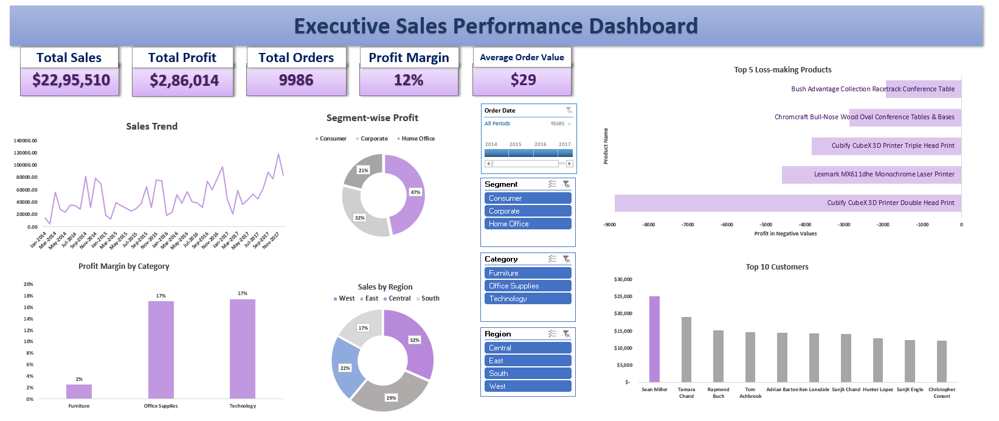

## Repository Contents

| File Name | Description |
|-----------|-------------|
| Sales_Performance_Dashboard.xlsx | Excel file containing the interactive sales dashboard |
| Dashboard.png | Screenshot preview of the dashboard |
| Executive Sales Dashboard - Excel.mp4 | Screen recording showing dashboard interactivity |

## Project Overview
This project presents an **Interactive Executive Sales Performance Dashboard** built in Microsoft Excel using the Superstore retail dataset.
The objective of this project was to analyze sales performance, identify profitability trends, and evaluate how different product categories, regions, and customer segments contribute to business revenue.
The dashboard consolidates key business metrics such as **Total Sales, Total Profit, Total Orders, Profit Margin, and Average Order Value**, enabling stakeholders to quickly assess business performance and explore trends using interactive filters.
This project demonstrates practical data analytics skills including **data exploration, KPI development, dashboard design, and business insight generation**.

## Dataset
The analysis uses the **Superstore Sales Dataset**, a retail transactional dataset containing approximately 9,994 records.
The dataset includes:
- Order and shipping details
- Customer segments
- Product categories and sub-categories
- Sales, profit, discount, and quantity metrics
- Regional sales distribution

## Dashboard Preview

## Interactive Dashboard Demo
The video below demonstrates the interactive features of the dashboard where filters dynamically update KPIs and visualizations.
[Watch Dashboard Demo](Executive Sales Dashboard - Excel.mp4)

## Key Performance Indicators
The dashboard tracks the following KPIs:
- Total Sales
- Total Profit
- Total Orders
- Profit Margin
- Average Order Value

## Key Insights
- The business generated **approximately $2.29M in total sales across 9,986 orders**, resulting in **$286K in total profit**, indicating steady overall business performance.
- The overall **profit margin is approximately 12%**, suggesting moderate profitability with potential room for margin optimization.
- The **Technology category contributes the highest profit**, making it the most profitable product segment for the company.
- The **Furniture category shows comparatively lower profit margins**, indicating potential opportunities for pricing adjustments, supplier renegotiation, or cost optimization.
- A small subset of **loss-making products contributes disproportionately to overall negative profit**, highlighting the need for product-level performance review and pricing strategy improvements.
- The **Consumer segment generates the largest share of total revenue**, suggesting strong demand from individual customers compared to corporate and home office segments.
- A relatively small group of **top customers contributes a significant portion of overall sales**, emphasizing the importance of customer retention and relationship management.
- Sales trends display **clear seasonal fluctuations**, which can **influence demand forecasting, inventory planning, and promotional strategies**.

## Business Recommendations
- **Expand high-performing Technology products** by increasing marketing focus and inventory availability, as this category contributes the highest overall profit.
- **Reevaluate pricing and cost structure in the Furniture category** to improve margins, potentially through supplier negotiations or optimized discount strategies.
- **Identify and address loss-making products** by reviewing pricing strategies, discontinuing consistently unprofitable items, or renegotiating supplier costs.
- **Strengthen relationships with high-value customers** through loyalty programs, personalized offers, and targeted engagement to maximize customer lifetime value.
- **Leverage seasonal sales patterns** to plan marketing campaigns, optimize inventory levels, and improve demand forecasting during peak sales periods.
- **Develop targeted marketing strategies for different customer segments**, particularly focusing on the Consumer segment which contributes the highest share of revenue.

## Tools & Skills Demonstrated
Tools:
- Microsoft Excel
- Pivot Tables
- Pivot Charts
- Slicers and Interactive Filters

Skills:
- Data Exploration and Cleaning
- KPI Development
- Business Performance Analysis
- Dashboard Design
- Data Visualization
